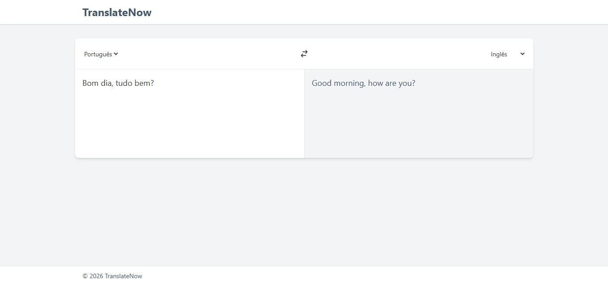

# 🌍 TranslateNow – Tradutor de Idiomas

Projeto Front-End de um tradutor de idiomas desenvolvido com React, focado no consumo de API externa, gerenciamento de estado e construção de uma interface moderna e responsiva.

## 🖥️ Demonstração
🔗 Site online: https://translator-flame-nu.vercel.app/  
🔗 Repositório: https://github.com/mellacer/Translator

## 📸 Preview


## 🛠️ Tecnologias Utilizadas
- React
- JavaScript
- Tailwind CSS
- API MyMemory Translation
- Fetch API

## ⚙️ Funcionalidades
- Tradução de textos entre diferentes idiomas
- Seleção dinâmica de idioma de origem e destino
- Troca rápida entre idiomas (swap)
- Tradução automática com delay (debounce)
- Indicador de carregamento durante a requisição
- Tratamento de erros
- Layout responsivo para desktop e mobile

## 📚 Objetivo do Projeto
Projeto desenvolvido com fins educacionais, com o objetivo de praticar:
- Consumo de APIs externas
- Requisições assíncronas com `fetch`
- Uso de Hooks (`useState` e `useEffect`)
- Renderização condicional
- Controle de estados e efeitos colaterais
- Construção de interfaces responsivas com React

## 📱 Responsividade
A aplicação é totalmente responsiva, adaptando-se a diferentes tamanhos de tela e mantendo a experiência de uso consistente em dispositivos desktop e mobile.

## 🚀 Como executar o projeto
```bash
# Clone o repositório
git clone https://github.com/mellacer/Translator

# Acesse a pasta do projeto
cd Translator

# Instale as dependências
npm install

# Inicie o projeto
npm run dev
